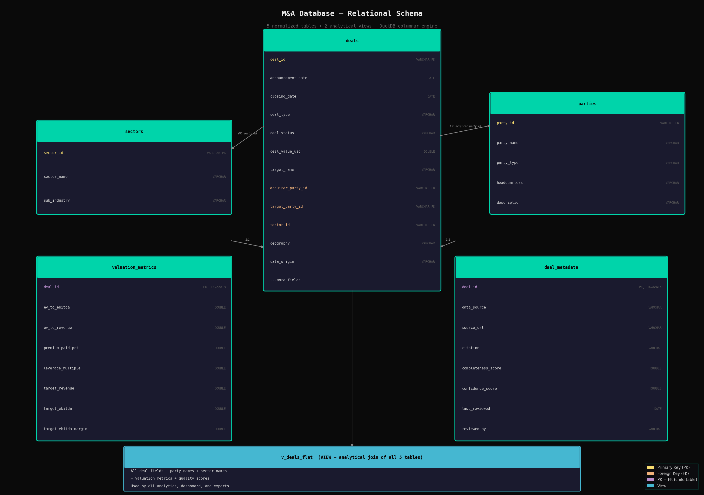

# M&A Database + Analysis Tool

Institutional-style M&A intelligence platform with relational deal database, regime detection, relative valuation analytics, and sponsor behavioral profiling.

---

## Overview

This is not a CSV viewer with filters. It is a structured intelligence platform built around a normalized relational database of M&A transactions, with an analytics engine that models how institutional investors actually think about deal markets.

The platform stores 390 transactions across 11 GICS-style sectors, split between 90 curated real deals and a 300-deal synthetic extension layer. Real and synthetic data are strictly separated, the dashboard defaults to real-only view, and every synthetic record is flagged throughout the UI and exports.

The analytical depth goes beyond basic aggregation. The platform detects market regime transitions (Peak/Recovery/Selective/Trough), computes relative valuation positioning by sector vs. market history, profiles sponsor behavior (Premium/Value/Market buyer classification), and surfaces momentum-based imbalance signals across sectors. A rule-based interpretation engine generates 5-section analyst-style memos with financial language, not data dumps, but structured observations with "which suggests..." framing.

---

## Dashboard

Six tabs, Bloomberg dark theme, global sidebar filters (date range, sector, deal type, acquirer, geography, data origin).

| Tab | Contents |
|-----|----------|
| **Overview** | KPI cards, regime timeline, deal trends (count + value), sector/sponsor rankings, deal type distribution, M&A Market Snapshot memo |
| **Valuation** | EV/EBITDA by sector (box plots), premium paid analysis, sponsor vs. strategic entry multiples, sector relative valuation, historical percentile positioning |
| **Market Activity** | Deal count/value over time, sector heatmap, sponsor vs. strategic trends, imbalance quadrant scatter, sector momentum signals |
| **Sponsor Intelligence** | Sponsor rankings, sector preferences heatmap, average entry multiples, per-sponsor behavioral profile cards |
| **Deal Explorer** | Filterable deal table, deal detail drill-down, CSV + Excel export |
| **Data Management** | Add/edit deal forms, bulk CSV import with validation preview, pipeline architecture diagram, data quality audit |

---

## Schema



Five normalized tables: `deals` (core transaction record), `parties` (unified sponsor + strategic acquirer entity), `sectors` (GICS-style taxonomy), `valuation_metrics` (one-to-one with deals), `deal_metadata` (source tracking + quality scores). Two analytical views: `v_deals_flat` (denormalized join) and `v_deals_summary` (pre-aggregated by year/sector/deal type).

Weighted completeness scoring across three tiers (Tier 1: announcement date, acquirer, target, deal type, sector, value, status, weight 3.0; Tier 2: valuation multiples, closing date, geography, weight 2.0; Tier 3: financing structure, source URL, notes, weight 1.0). Confidence scoring based on data origin and source citation.

---

## Key Analytics

### Regime Detection
Classifies each year as **Peak/Late-Cycle**, **Recovery/Opportunity**, **Selective/Cautious**, or **Trough/Distressed** based on deal activity and median EV/EBITDA relative to full-period historical medians. Sponsor-led vs. strategic-led mix is a third axis.

### Relative Valuation
Sector premium/discount vs. market median, historical percentile positioning (where is the current sector median vs. its own 10-year range), and sponsor vs. strategic entry multiple spread, by sector.

### Sponsor Behavioral Profiling
Per-sponsor: **Premium Buyer** (avg EV/EBITDA > market + 1.0x), **Value Buyer** (< market − 1.0x), or **Market Buyer**. Plus sector concentration, deal size profile vs. market, and regime activity timing.

### Market Imbalance Detection
Momentum-based signals from activity (deal count last 2yr vs. prior 3yr) and valuation (median EV/EBITDA last 2yr vs. prior 3yr): **Overheating**, **Healthy Growth**, **Narrowing**, or **Cooling**.

### Strategic Memo
5-section analyst commentary auto-generated from current filter state: Market Regime → Sector Signals → Sponsor Activity → Valuation Environment → Watch List. Max 400 words. Every observation ends with actionable framing.

---

## Data

| | Count | Notes |
|---|---|---|
| **Real deals** | 90 | Curated from public sources, 2015-2024 |
| **Synthetic extension** | 300 | Realistic distributions, recency-weighted, separately filterable |
| **Sectors** | 11 | GICS-style with sub-industries |
| **Sponsors** | 25 | Blackstone, KKR, Apollo, Thoma Bravo, Vista, Carlyle, and more |
| **Total disclosed value** | ~$1.7T | Real deals only, in millions USD |

All records carry `data_origin = real | synthetic`. Synthetic records never create the impression of a real transaction.

---

## Tech Stack

| Component | Technology |
|-----------|------------|
| Database | DuckDB (columnar, single-file) |
| Backend | Python, Pandas |
| Dashboard | Streamlit, Plotly |
| Export | CSV, Excel (openpyxl) |
| Testing | pytest, 124 tests (62 core + 62 hardened) |

---

## Quick Start

```bash
# Install dependencies
pip install -r requirements.txt

# Initialize database and seed data
python3 main.py

# Launch dashboard
python3 -m streamlit run app/streamlit_app.py
```

---

## Project Structure

```
ma-database/
├── main.py                          # Orchestrator only
├── config.yaml                      # All parameters, weights, thresholds
│
├── ma/
│   ├── db/
│   │   ├── engine.py                # DuckDB connection manager
│   │   ├── schema.py                # Table creation, views, constraints
│   │   └── queries.py               # Reusable analytical queries
│   │
│   ├── ingest/
│   │   ├── seed_real.py             # Load curated real deal dataset
│   │   ├── seed_synthetic.py        # Generate synthetic extension layer
│   │   ├── csv_import.py            # Bulk CSV import with validation
│   │   └── validator.py             # Field validation, duplicate detection
│   │
│   ├── analytics/
│   │   ├── valuation.py             # EV/EBITDA, premium analysis
│   │   ├── market_activity.py       # Deal count/value trends, heatmaps
│   │   ├── sponsor_intel.py         # Sponsor rankings and preferences
│   │   ├── execution.py             # Time-to-close, deal status
│   │   ├── snapshot.py              # M&A Market Snapshot memo
│   │   ├── regime.py                # Regime detection and classification
│   │   ├── sponsor_profile.py       # Per-sponsor behavioral profiling
│   │   ├── relative_valuation.py    # Sector premium/discount, percentile
│   │   ├── imbalance.py             # Market imbalance signal detection
│   │   └── interpretation.py        # Rule-based analyst commentary
│   │
│   ├── scoring/
│   │   ├── completeness.py          # Weighted completeness score
│   │   └── confidence.py            # Rule-based confidence score
│   │
│   └── export/
│       ├── csv_export.py
│       └── excel_export.py
│
├── data/
│   └── raw/
│       └── real_deals.csv           # Curated real deal dataset (90 deals)
│
├── app/
│   └── streamlit_app.py             # 6-tab dashboard
│
├── docs/
│   ├── analysis.md                  # Investment-style market analysis
│   └── schema_diagram.png           # Relational schema diagram
│
└── tests/                           # 124 tests
```

---

## Testing

```bash
# Run all tests
pytest tests/ -v

# Hardened stress tests only
pytest tests/test_hardened.py -v
```

124 tests covering: schema integrity, ingestion pipeline, validation edge cases, completeness math, confidence scoring, valuation analytics, market activity, sponsor intelligence, snapshot memo generation, export integrity, relational integrity, data origin isolation, synthetic data realism, and database constraints.

---

## License

MIT
